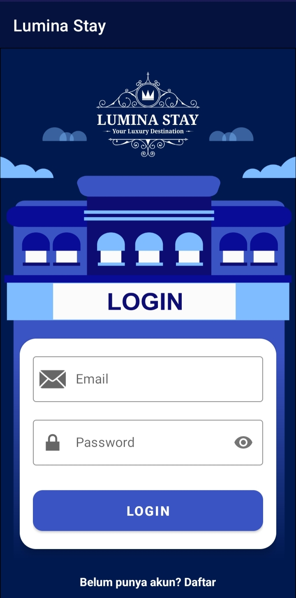
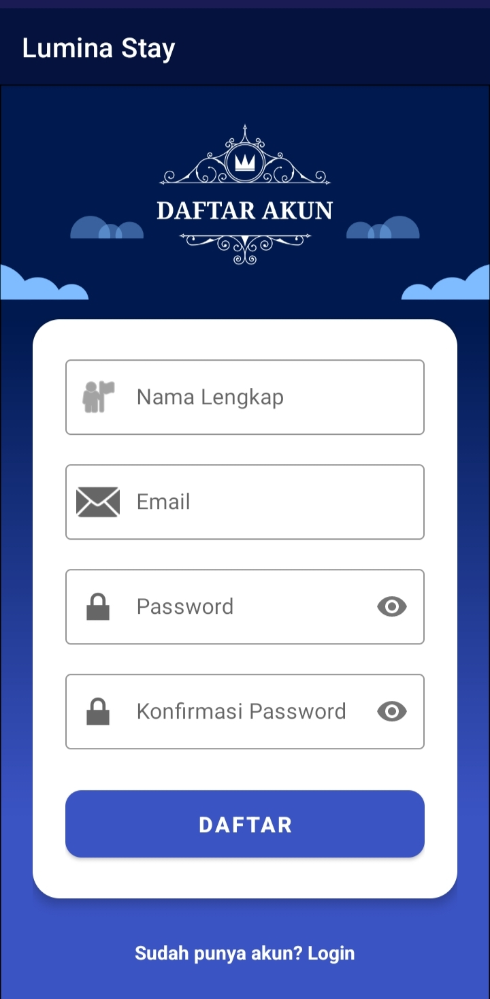
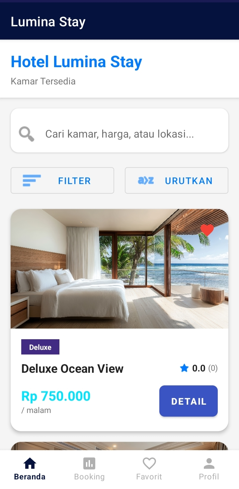
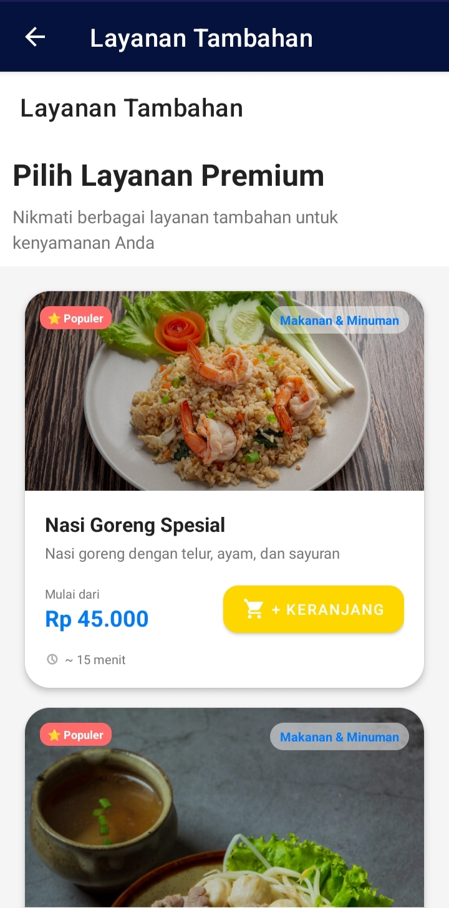

# LuminaStay - Hotel Booking Android Application

## Deskripsi Proyek

LuminaStay merupakan aplikasi pemesanan hotel berbasis Android yang dirancang untuk memberikan kemudahan bagi pengguna dalam mencari, melihat, dan memesan kamar hotel secara praktis melalui perangkat mobile. Aplikasi ini menyediakan berbagai fitur mulai dari autentikasi pengguna, katalog kamar, detail kamar, layanan tambahan hotel, hingga riwayat pemesanan dalam satu platform yang terintegrasi.

Proyek ini dikembangkan sebagai implementasi pengembangan aplikasi mobile menggunakan Android Studio dengan bahasa pemrograman Java dan Kotlin serta memanfaatkan SQLite untuk penyimpanan data lokal.

---

## Tampilan Aplikasi

### Banner Aplikasi

<p align="center">
  
</p>

### Halaman Login dan Registrasi

<p align="center">
  
  
</p>

### Halaman Beranda

<p align="center">
  
</p>

### Fitur Pemesanan Layanan Hotel

<p align="center">
  
</p>

---

## Latar Belakang

Perkembangan teknologi mobile telah mengubah cara masyarakat melakukan reservasi hotel. Pengguna kini menginginkan proses pemesanan yang cepat, mudah, dan dapat dilakukan kapan saja melalui smartphone.

LuminaStay hadir sebagai solusi pemesanan hotel berbasis Android yang menyediakan informasi kamar, layanan hotel, serta proses reservasi dalam antarmuka yang modern dan mudah digunakan.

---

## Fitur Utama

### Autentikasi Pengguna

* Registrasi akun
* Login pengguna
* Manajemen profil pengguna

### Manajemen Kamar Hotel

* Menampilkan daftar kamar hotel
* Detail informasi kamar
* Kategori dan fasilitas kamar
* Sistem favorit kamar

### Reservasi Hotel

* Pemesanan kamar
* Riwayat pemesanan
* Detail transaksi booking

### Layanan Tambahan Hotel

* Pemesanan makanan dan minuman
* Pemesanan layanan tambahan hotel
* Riwayat transaksi layanan

### Fitur Pendukung

* Splash Screen
* Bottom Navigation
* Google Maps Integration
* Tampilan responsif dan modern
* Animasi antarmuka pengguna

---

## Teknologi yang Digunakan

### Mobile Development

* Android Studio
* Java
* Kotlin

### Database

* SQLite

### UI Components

* Material Design
* RecyclerView
* Fragment
* Navigation Component

### Library dan Dependency

* AndroidX
* Google Material Design
* Google Maps SDK
* Google Play Services Location
* Lottie Animation

---

## Struktur Proyek

```text
app/
├── activities/
├── adapters/
├── database/
├── fragments/
├── models/
├── services/
└── ui/

res/
├── drawable/
├── layout/
├── menu/
├── mipmap/
└── values/
```

---

## Alur Penggunaan

1. Pengguna melakukan registrasi akun.
2. Pengguna login ke dalam aplikasi.
3. Pengguna melihat daftar kamar yang tersedia.
4. Pengguna memilih kamar yang diinginkan.
5. Pengguna melakukan proses pemesanan kamar.
6. Pengguna dapat menambahkan layanan hotel tambahan.
7. Riwayat transaksi dapat dilihat pada menu riwayat pemesanan.

---

## Persyaratan Sistem

### Software

* Android Studio
* JDK 8 atau lebih baru
* Gradle
* Android SDK

### Minimum Android Version

```text
Android 7.0 (API Level 24)
```

---

## Instalasi

### Clone Repository

```bash
git clone https://github.com/lutfilaelina/luminastay-hotel-booking-app.git
```

### Buka Project

```text
Android Studio → Open Project → LuminaStay
```

### Jalankan Aplikasi

1. Sinkronisasi Gradle.
2. Hubungkan emulator atau perangkat Android.
3. Klik tombol Run pada Android Studio.

---

## Tujuan Pengembangan

Proyek ini dikembangkan sebagai media pembelajaran dan implementasi pengembangan aplikasi mobile Android dengan studi kasus sistem pemesanan hotel. Selain itu, aplikasi ini bertujuan untuk menerapkan konsep manajemen data, antarmuka pengguna, navigasi aplikasi, dan pengelolaan transaksi dalam lingkungan Android.

---

## Pengembang

1. Moh. Arif Prasetyo
2. Veri Aji Saputra
3. Lutfi Laeli Nur Afiyah
4. Feldi Sanjaya
5. Naufal Miftahul Arsyi
6. Muhammad Yasir Ilham Nabil

---

## Disclaimer

Aplikasi LuminaStay dikembangkan untuk keperluan pembelajaran dan pengembangan keterampilan dalam bidang mobile development. Seluruh data dan transaksi yang digunakan dalam aplikasi ini bersifat simulasi dan tidak terhubung dengan layanan pemesanan hotel komersial.
